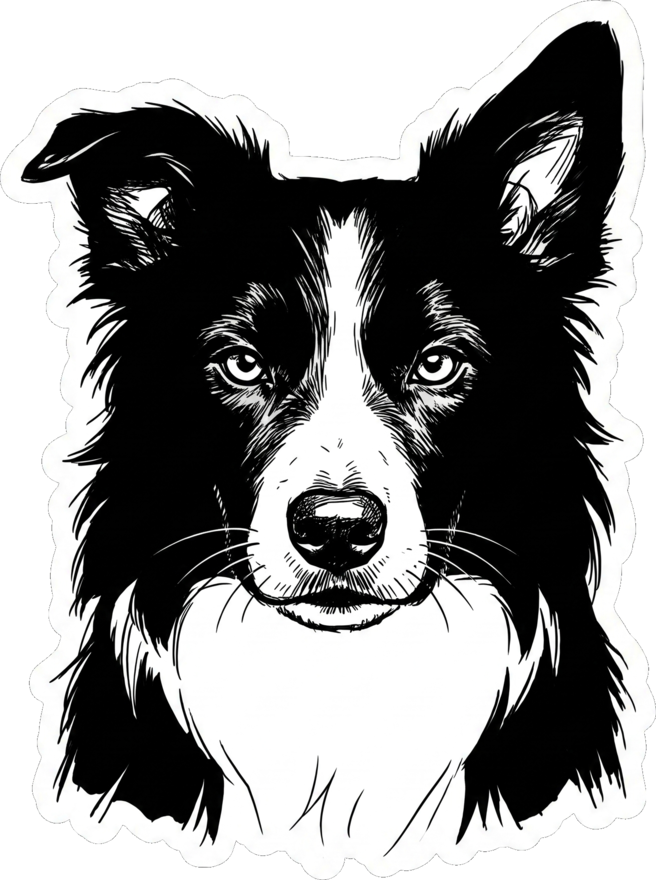
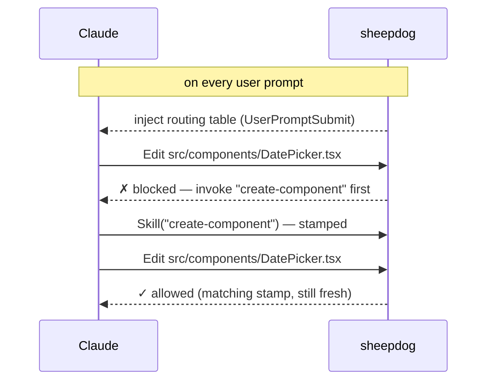

<p align="center">
  <picture>
    <source media="(prefers-color-scheme: dark)" srcset="assets/logo-dark.png">
    
  </picture>
</p>

<h1 align="center">sheepdog</h1>

<p align="center">
  <em>No matching skill, no edit.</em>
</p>

<p align="center">
  sheepdog herds Claude Code through your project's conventions.
</p>

<p align="center">
  
  
  
  
  
  
</p>

<p align="center">
  <a href="#before--after">See it</a> ·
  <a href="#quickstart">Quickstart</a> ·
  <a href="#how-it-works">How it works</a> ·
  <a href="#configjson-reference">Config</a> ·
  <a href="#failure-modes--guarantees">Failure modes</a> ·
  <a href="#faq">FAQ</a>
</p>

---

You wrote skills so Claude would follow your project's standards to the letter: how
a component is structured, what an API route returns, how a migration is written.
Claude read them. And forty minutes into a session, it writes the component by hand
anyway — its own way, politely, confidently, wrong.

Ask it afterwards why it skipped the skill and you get the same answer every time:
*"I thought I didn't need it."* It did need it. That is the flaw in advisory
guidance: **the model decides when your conventions apply, and it decides wrong
exactly when it matters.**

sheepdog takes that decision away from the model. Like the border collie it's named
after, it doesn't cage the agent — it herds it. Inside the directories you declare
governed, every edit must go through the skill that documents exactly how that task
is done in this project — invoked fresh, minutes ago, not remembered from last
Tuesday. A reminder on every prompt keeps the agent in the flock; a hard gate turns
it back the moment it strays.

The plugin is **project-agnostic** and ships zero rules of its own. Each project
declares what is governed, and by which skill, in `.claude/sheepdog/config.json`.
On a project that hasn't opted in, it is a silent no-op.

## Before / After

<table>
<tr>
<th width="50%">Without sheepdog</th>
<th width="50%">With sheepdog</th>
</tr>
<tr>
<td valign="top">

```
⏺ Write(src/components/DatePicker.tsx)
  ⎿ Wrote 214 lines
```

Its own props API, its own CSS, none of your
design system — merged before anyone notices.

</td>
<td valign="top">

```
⏺ Write(src/components/DatePicker.tsx)
  ⎿ ✗ blocked — invoke the skill
    "create-component" first

⏺ Skill(create-component)

⏺ Write(src/components/DatePicker.tsx)
  ⎿ Wrote 32 lines
```

Same request. The convention survived.

</td>
</tr>
</table>

## Quickstart

Prerequisite: `jq` (preinstalled on macOS 15+; `brew install jq` / `apt install jq`
elsewhere).

```
/plugin marketplace add avantsoftware/sheepdog
/plugin install sheepdog@avantsoft
/reload-plugins
```

Then, inside the project you want to gate:

```
/sheepdog:setup
```

It discovers the project's skills, scaffolds **`.claude/sheepdog/config.json`**
(commit it — these are shared team rules) and adds a `.gitignore` entry for
**`.claude/sheepdog/.skill-used`** (runtime state — never commit it).

## How it works

Three bash hooks, all reading project-owned config from
`$CLAUDE_PROJECT_DIR/.claude/sheepdog/`:

| Hook | Event | Role |
| --- | --- | --- |
| `skill-reminder.sh` | `UserPromptSubmit` | **Bark** — injects a reminder + the path→skill routing table (generated from `rules`) on every prompt. |
| `stamp-skill.sh` | `PostToolUse(Skill)` | **Witness** — records `<timestamp> <skill>` in `.skill-used` whenever a skill is invoked. |
| `require-skill.sh` | `PreToolUse(Edit\|Write\|MultiEdit)` | **Gate** — matches the edited file against `rules`; blocks unless the matching skill was stamped within the window. |



When an edit is rejected, the error is a recovery recipe, not a slap:

```
  ✗  sheepdog blocked this edit

     File       /repo/src/components/DatePicker.tsx
     Why        No skill has been invoked yet, so no edit to this path is authorized.
     Required   the "create-component" skill

  →  Do this now: invoke the Skill tool with skill "create-component", then re-apply this exact edit.
     This path is governed by .claude/sheepdog/config.json; the skill stays valid for 5 min after you invoke it.
```

Claude invokes the skill, re-applies the edit, and the gate lets it through.

## `config.json` reference

```json
{
  "window": 600,
  "overrides": ["scaffold-feature"],
  "rules": [
    { "glob": "*/src/components/ui/*", "skill": "create-ui-primitive", "desc": "design-system primitives" },
    { "glob": "*/src/components/*", "skill": "create-component", "desc": "UI components" },
    { "glob": "*/src/api/*", "skill": "create-api-route", "desc": "API routes" },
    { "glob": "*/db/migrations/*", "skill": "create-migration", "desc": "database migrations" }
  ]
}
```

- **`rules`** — ordered list of `{ "glob", "skill", "desc"? }`. **First matching glob
  wins**, so order specific → general (above, a file in `components/ui/` hits the
  primitives rule, never the generic component one). `desc` is an optional label
  shown in the routing table (and, since JSON has no comments, the place to document
  intent).
- **`window`** (optional, default `300`) — seconds a stamped skill stays valid.
- **`overrides`** (optional) — skills that may edit ANY governed path, e.g. a
  `scaffold-feature` orchestrator that legitimately composes a migration, a route
  and a component in one flow.
- **`reminder`** (optional) — replaces the default preamble injected on every prompt;
  the generated routing table is appended after it either way.

Globs have shell-`case` semantics: `*` matches any run of characters **including
`/`**, `?` matches exactly one. Patterns match against the absolute file path.

## Failure modes & guarantees

> [!IMPORTANT]
> The gate never turns itself off quietly. Broken config, misspelled key, missing
> `jq` — on a governed project these **block all edits** with instructions, instead
> of silently disabling enforcement.

| Situation | Behavior |
| --- | --- |
| No `.claude/sheepdog/` in the project | Silent no-op: nothing injected, nothing blocked |
| Edited file matches no rule | Allowed |
| Matching skill stamped within the window | Allowed |
| No skill invoked yet | Blocked; message names the required skill |
| A *different* skill was invoked last | Blocked — the stamp holds only the LAST skill invoked |
| Right skill, stamped too long ago | Blocked as expired |
| Fresh stamp of an `overrides` skill | Allowed on any governed path |
| `config.json` unparseable / unknown key (e.g. `"ruls"`) | **All** edits blocked with the exact error; every prompt injects a warning |
| `jq` not found anywhere | Governed project: all edits blocked with install instructions; ungoverned: no-op |

Two guarantees behind that table:

- **State lives in the project**, never in the plugin cache (`$CLAUDE_PLUGIN_ROOT`
  is a read-only cache that changes on every update).
- **Only the last skill counts.** Invoking any other skill between the required one
  and the edit revokes the authorization — enforcing the sequence "right skill →
  edit", not "right skill at some point".

## Distribute to a team

Commit `.claude/sheepdog/config.json` in the target repo, then have teammates run
the install commands — or wire it into the repo's `.claude/settings.json` so it's
automatic:

```json
{
  "extraKnownMarketplaces": {
    "avantsoft": { "source": { "source": "github", "repo": "avantsoftware/sheepdog" } }
  },
  "enabledPlugins": { "sheepdog@avantsoft": true }
}
```

## FAQ

**Every edit is suddenly blocked.** Read the block message — it names the cause:
either `config.json` doesn't parse / has an unknown key (fix the file), or `jq`
can't be found (install it). Both are deliberate fail-closed states.

**I invoked the right skill and still got blocked.** Either another skill was
invoked after it (only the last stamp counts — invoke the required one again), or
the window expired (default 5 min; raise `window` if your flows are longer).

**How do I bypass it in an emergency?** The gate only intercepts Claude Code's
Edit/Write tools — your editor and git are untouched. To disable it for Claude too,
rename/remove `.claude/sheepdog/config.json` or disable the plugin.

**Does it work on Windows?** The hooks are bash + jq, so: WSL/Git Bash yes, native
cmd/PowerShell no.

**Why such a short window?** A fresh stamp means "the conventions are in context
*right now*". Long windows let authorization outlive the context that justified it.
It's per-project tunable via `window`.

## Development

```
sheepdog/
  hooks/
    require-skill.sh    # the PreToolUse gate
    stamp-skill.sh      # the PostToolUse(Skill) stamp
    skill-reminder.sh   # the UserPromptSubmit reminder
    lib/common.sh       # config loading/validation, jq lookup, shared helpers
  skills/setup/         # the /sheepdog:setup scaffolding skill
test/hooks.test.sh      # end-to-end suite (60 scenarios)
```

Run the tests (no setup — they drive the hooks exactly like Claude Code does, piping
hook JSON on stdin, under macOS system bash 3.2 to catch bashisms):

```
bash test/hooks.test.sh
```

Try the plugin against a local checkout without installing:

```
claude --plugin-dir ./sheepdog
```
