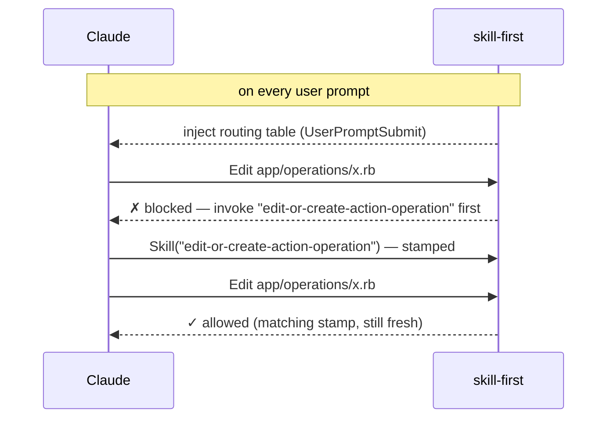

# skill-first

> Require the *right* skill to be invoked before Claude Code edits governed files —
> a reminder on every prompt, and a hard gate when the reminder isn't enough.

Skills are how a team teaches Claude its conventions: how an endpoint is created,
what an operation looks like, how a serializer is structured. But skills are
advisory — nothing stops the model from editing `app/operations/` by hand, and deep
into a long session it will. Guidance in context decays; an agent in a hurry takes
the direct path; the hand-edit that skips your workflow gets merged.

**skill-first turns "use the skill" from a suggestion into a precondition.** Editing
a governed file without first invoking its matching skill is rejected at the tool
level, with an error that tells Claude exactly how to recover.

The plugin is **project-agnostic** and ships zero rules of its own. Each project
declares what is governed and by which skill in `.claude/skill-first/config.json`.
On a project that hasn't opted in, the plugin is a silent no-op.

## Quickstart

Prerequisite: `jq` (preinstalled on macOS 15+; `brew install jq` / `apt install jq`
elsewhere).

```
/plugin marketplace add avantsoftware/skill-first
/plugin install skill-first@avantsoft
/reload-plugins
```

Then, inside the project you want to gate:

```
/skill-first:setup
```

It discovers the project's skills, scaffolds **`.claude/skill-first/config.json`**
(commit it — these are shared team rules) and adds a `.gitignore` entry for
**`.claude/skill-first/.skill-used`** (runtime state — never commit it).

## How it works

Three bash hooks, all reading project-owned config from
`$CLAUDE_PROJECT_DIR/.claude/skill-first/`:

| Hook | Event | Role |
| --- | --- | --- |
| `skill-reminder.sh` | `UserPromptSubmit` | **Nudge** — injects a reminder + the path→skill routing table (generated from `rules`) on every prompt. |
| `stamp-skill.sh` | `PostToolUse(Skill)` | **Witness** — records `<timestamp> <skill>` in `.skill-used` whenever a skill is invoked. |
| `require-skill.sh` | `PreToolUse(Edit\|Write\|MultiEdit)` | **Gate** — matches the edited file against `rules`; blocks unless the matching skill was stamped within the window. |



## What it looks like in practice

On every prompt, Claude sees the routing table:

```
[skill-first] STOP. Before editing files in this project, invoke the matching skill
below via the Skill tool FIRST, then edit. [...]

Routing (what you're touching -> required skill):
- */app/operations/base/* (base operations) -> edit-or-create-base-operation
- */app/operations/* -> edit-or-create-action-operation
```

If Claude edits a governed file anyway, the edit is rejected with a recovery recipe:

```
  ✗  skill-first blocked this edit

     File       /repo/app/operations/create_user.rb
     Why        No skill has been invoked yet, so no edit to this path is authorized.
     Required   the "edit-or-create-action-operation" skill

  →  Do this now: invoke the Skill tool with skill "edit-or-create-action-operation", then re-apply this exact edit.
     This path is governed by .claude/skill-first/config.json; the skill stays valid for 5 min after you invoke it.
```

Claude invokes the skill (which stamps `.skill-used`), re-applies the edit, and the
gate lets it through.

## `config.json` reference

```json
{
  "window": 600,
  "overrides": ["edit-or-create-endpoint"],
  "rules": [
    { "glob": "*/app/operations/base/*", "skill": "edit-or-create-base-operation", "desc": "base operations" },
    { "glob": "*/app/operations/*", "skill": "edit-or-create-action-operation" },
    { "glob": "*/app/serializers/*", "skill": "edit-or-create-serializer" }
  ]
}
```

- **`rules`** — ordered list of `{ "glob", "skill", "desc"? }`. **First matching glob
  wins**, so order specific → general. `desc` is an optional label shown in the
  routing table (and, since JSON has no comments, the place to document intent).
- **`window`** (optional, default `300`) — seconds a stamped skill stays valid.
- **`overrides`** (optional) — skills that may edit ANY governed path, e.g. an
  orchestrator skill that composes several governed edits in one flow.
- **`reminder`** (optional) — replaces the default preamble injected on every prompt;
  the generated routing table is appended after it either way.

Globs have shell-`case` semantics: `*` matches any run of characters **including
`/`**, `?` matches exactly one. Patterns match against the absolute file path.

## Failure modes & guarantees

For an enforcement tool, what happens when things go wrong *is* the design. The rule
everywhere: **loud beats silent** — the gate never turns itself off quietly.

| Situation | Behavior |
| --- | --- |
| No `.claude/skill-first/` in the project | Silent no-op: nothing injected, nothing blocked |
| Edited file matches no rule | Allowed |
| Matching skill stamped within the window | Allowed |
| No skill invoked yet | Blocked; message names the required skill |
| A *different* skill was invoked last | Blocked — the stamp holds only the LAST skill invoked |
| Right skill, stamped too long ago | Blocked as expired |
| Fresh stamp of an `overrides` skill | Allowed on any governed path |
| `config.json` unparseable / unknown key (e.g. `"ruls"`) | **All** edits blocked with the exact error; every prompt injects a warning |
| `jq` not found anywhere | Governed project: all edits blocked with install instructions; ungoverned: no-op |

Two guarantees behind that table:

- **State lives in the project**, never in the plugin cache (`$CLAUDE_PLUGIN_ROOT`
  is a read-only cache that changes on every update).
- **Only the last skill counts.** Invoking any other skill between the required one
  and the edit revokes the authorization — enforcing the sequence "right skill →
  edit", not "right skill at some point".

## Legacy format

Projects set up before `config.json` used `gate-map.conf` (`<glob>|<skill>` lines,
`@override|<skill>`) plus a hand-written `routing.md`. Both are still honored when
`config.json` is absent; `config.json` supersedes them. `/skill-first:setup` can
migrate.

## Distribute to a team

Commit `.claude/skill-first/config.json` in the target repo, then have teammates run
the install commands — or wire it into the repo's `.claude/settings.json` so it's
automatic:

```json
{
  "extraKnownMarketplaces": {
    "avantsoft": { "source": { "source": "github", "repo": "avantsoftware/skill-first" } }
  },
  "enabledPlugins": { "skill-first@avantsoft": true }
}
```

## FAQ

**Every edit is suddenly blocked.** Read the block message — it names the cause:
either `config.json` doesn't parse / has an unknown key (fix the file), or `jq`
can't be found (install it). Both are deliberate fail-closed states.

**I invoked the right skill and still got blocked.** Either another skill was
invoked after it (only the last stamp counts — invoke the required one again), or
the window expired (default 5 min; raise `window` if your flows are longer).

**How do I bypass it in an emergency?** The gate only intercepts Claude Code's
Edit/Write tools — your editor and git are untouched. To disable it for Claude too,
rename/remove `.claude/skill-first/config.json` or disable the plugin.

**Does it work on Windows?** The hooks are bash + jq, so: WSL/Git Bash yes, native
cmd/PowerShell no.

**Why such a short window?** A fresh stamp means "the conventions are in context
*right now*". Long windows let authorization outlive the context that justified it.
It's per-project tunable via `window`.

## Development

```
skill-first/
  hooks/
    require-skill.sh    # the PreToolUse gate
    stamp-skill.sh      # the PostToolUse(Skill) stamp
    skill-reminder.sh   # the UserPromptSubmit reminder
    lib/common.sh       # config loading/validation, jq lookup, shared helpers
  skills/setup/         # the /skill-first:setup scaffolding skill
test/hooks.test.sh      # end-to-end suite (60 scenarios)
```

Run the tests (no setup needed — they drive the hooks exactly like Claude Code does,
piping hook JSON on stdin, under macOS system bash 3.2 to catch bashisms):

```
bash test/hooks.test.sh
```

Try the plugin against a local checkout without installing:

```
claude --plugin-dir ./skill-first
```
